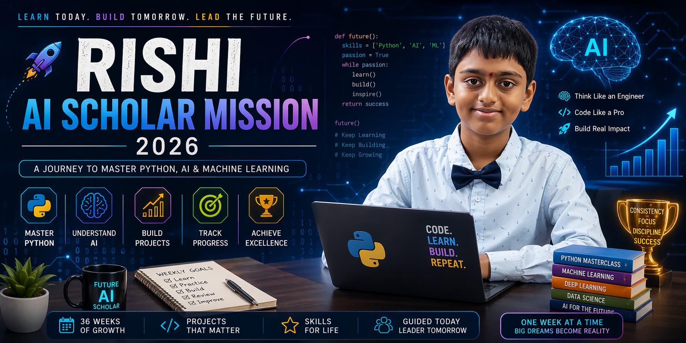

# Hey there 👋 I'm Rishi Akshintala

🎓 Class 11 Student  
🔥 Scored **96% in CBSE Class 10**  
💻 Exploring **Python | AI | Machine Learning | Data Science**  
🚀 Building cool projects and leveling up every week  
🌍 India  

---

<p align="center">
  
</p>

## ✨ About Me

I'm a student who loves learning new things, solving problems, and building future-ready skills early.  

Right now I'm focused on becoming strong in:

🐍 Python Programming  
📊 Data Analysis  
🤖 Artificial Intelligence  
🧠 Machine Learning  
🛠️ Real Project Building  

---

## 🌱 Current Mission: AI Scholar 2026

📌 Learn step by step  
📌 Build projects consistently  
📌 Create a strong GitHub portfolio  
📌 Join competitions & Kaggle  
📌 Become industry-ready early  

---

## 🚧 Projects I'm Working On

🎯 Quiz App  
💰 Expense Tracker  
📈 Cricket Stats Dashboard  
🏠 House Price Predictor  
🤖 AI Study Assistant  

*(More projects dropping soon...)*

---

## 📚 Currently Learning

✅ Python Basics  
✅ Logic Building  
✅ Statistics for AI  
✅ Machine Learning Foundations  
✅ GitHub Workflow  

---

## ⚡ Strengths

💯 Discipline  
🧩 Problem Solving  
📚 Curiosity  
🔥 Consistency  
🚀 Growth Mindset  

---

## 📈 2026 Goals

🌟 Complete AI Learning Roadmap  
🌟 Build 10+ Projects  
🌟 Master Machine Learning Basics  
🌟 Strong GitHub Profile  
🌟 Start Real AI Development Early  

---

## 🎵 Mood

```python
while(success == False):
    learn()
    build()
    improve()
